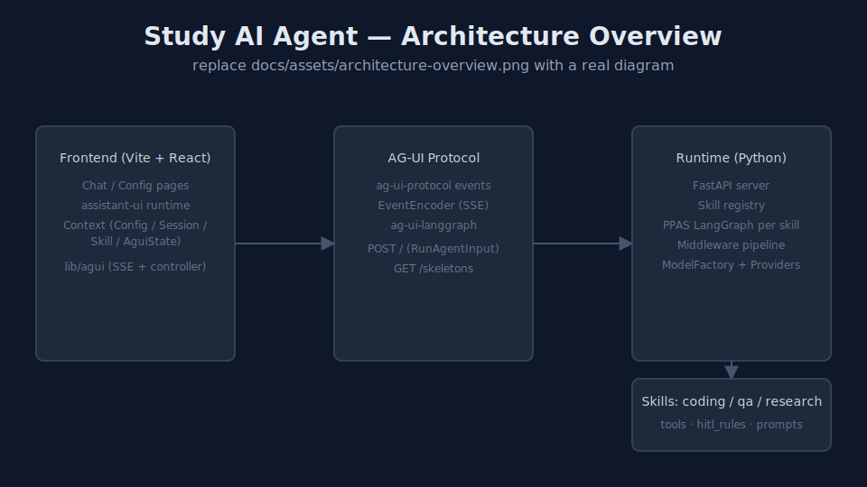

<div align="center">

# Study AI Agent

一个基于 **LangChain 1.x + LangGraph + AG-UI 协议** 的多智能体学习项目。

后端用 **PPAS 图**（Planner → Executor → Reviewer → Aggregator）参数化出 coding / research / qa 三个技能，
通过 [AG-UI](https://docs.ag-ui.com/) SSE 流式协议统一暴露；前端用 **React + assistant-ui** 还原一个能看 plan / review / citations 的聊天工作台。

> 仅作学习用途，意在把 LangChain 1.x 的 `create_agent` / `AgentMiddleware` / `HumanInTheLoopMiddleware` 生态跑通，演示如何组装一个**可扩展的多智能体工程**。

</div>

---

## 特性

- **多智能体技能**：内置 `coding` / `research` / `qa` 三个 skill，按 `forwarded_props.skill` 路由到独立编译的 LangGraph。
- **PPAS 编排**：统一的 Planner → Executor → Reviewer → Aggregator 图，Reviewer 给出 `revise` 即可回环到 Planner，由 `recursion_limit` 兜底。
- **可插拔模型供应商**：`priority` / `round_robin` / `random` 三种策略，已适配 **DeepSeek / 智谱 GLM / 通义千问 / 千帆**。
- **类型安全的状态契约**：`Plan` / `Review` / `Citation` / `CodeChange` 全 Pydantic 模型，贯穿子 agent 与外层 LangGraph state。
- **中间件管线**：Security → Context → Validation → Transformation → HITL → Logging → Error → Persistence → Routing → Testing，顺序设计可参考 [`src/core/middleware/__init__.py`](study_ai_agent/src/core/middleware/__init__.py)。
- **HITL 门禁**：对破坏性工具（`write_file` / `shell_exec` / `git_push` …）按 skill 配置 `approve` / `edit` / `reject` 决策集。
- **AG-UI 协议挂载**：一个 `POST /` 端点跑多个已编译图，前端 SSE 流式消费事件。
- **现代前端栈**：Vite + React 18 + TypeScript + Tailwind CSS + assistant-ui，多会话 / 暗色主题 / 快捷键 / 状态面板一应俱全。
- **按工具白名单开代理**：`TOOL_PROXY_WHITELIST` + `TOOL_HTTP_PROXY` 即可让个别网络类工具（Wikipedia / DuckDuckGo）走代理，调用完立即还原 env，**不污染** LLM 供应商和其他直连工具。详见 [`study_ai_agent/README.md`](study_ai_agent/README.md#网络类工具代理)。

## 项目结构

```
study_ai_agent/                 # ← 仓库根（monorepo）
├── study_ai_agent/             # Python 后端（LangChain + LangGraph + AG-UI）
│   ├── src/
│   │   ├── core/               # 运行时：graph / nodes / middleware / tools / server
│   │   ├── skills/             # skill 注册表（coding / research / qa）
│   │   ├── providers/          # 模型供应商 wrapper（DeepSeek / Qwen / ZhipuAI / Qianfan）
│   │   ├── config/             # pydantic-settings 配置
│   │   └── logging/            # 日志初始化
│   ├── cli/                    # 入口命令：dev / prod / lint / fmt
│   ├── tests/                  # 单元 / LLM / 集成 / 手动测试
│   ├── pyproject.toml
│   ├── requirements.txt
│   └── justfile
│
├── study_ai_agent_ui/          # React 前端（Vite + assistant-ui）
│   ├── src/
│   │   ├── pages/              # 路由页：Chat / Config
│   │   ├── components/         # Layout / History / assistant-ui
│   │   ├── lib/agui/           # AG-UI SSE 适配 + 聊天 controller
│   │   ├── context/            # 全局 Context：Config / Session / Skill / AguiState
│   │   ├── features/           # 业务子模块：config / sessions / skills
│   │   └── config/             # 前端 env 配置
│   ├── package.json
│   └── vite.config.ts
│
├── tests/                      # 端到端 / 跨栈测试
├── docs/                       # 设计文档（ARCHITECTURE / AGENTS / …）
├── LICENSE                     # MIT
└── README.md                   # 你正在读的
```

## 架构一览

<!-- ARCHITECTURE 占位：docs/assets/architecture-overview.svg 是占位图，正式发布前请替换为 PNG/SVG 架构图 -->


更详细的设计稿（中间件顺序、PPAS 图、AG-UI 事件流）见 [`docs/ARCHITECTURE.md`](docs/ARCHITECTURE.md)。

## 5 分钟跑起来

### 方式 A：本地（venv + npm）

完整步骤见 [`docs/QUICKSTART.md`](docs/QUICKSTART.md)，下面是极简版：

```bash
# 1. 准备后端
cd study_ai_agent
python -m venv .venv
.\.venv\Scripts\Activate.ps1   # Windows；POSIX 用户用 source .venv/bin/activate
pip install -e ".[dev]"
just env-dev                    # 生成 .env.development
# 编辑 .env.development，至少填一个 LLM 的 API Key（DASHSCOPE / DEEPSEEK / ZAI / QIANFAN 任一）
dev                             # 控制台脚本，等价于 `python main.py`，ENV=development

# 2. 准备前端
cd ../study_ai_agent_ui
npm install
npm run dev                     # http://localhost:3000
```

打开浏览器后会自动跳到 `/chat`，在左侧选择智能体（默认 `research`），右侧可以实时看到 plan / review / citations 的变化。

### 方式 B：Docker / Docker Compose

```bash
# 在仓库根
cp .env.example .env             # 编辑后填入至少 1 个 LLM API Key
docker compose build
docker compose up -d

# 打开浏览器
#   前端：http://localhost:3000
#   后端健康：http://localhost:8000/health
```

详见 [`docs/DOCKER.md`](docs/DOCKER.md)。

## 文档导航

| 文档 | 适合谁 | 介绍 |
| --- | --- | --- |
| [docs/QUICKSTART.md](docs/QUICKSTART.md) | 新用户 | 5 分钟本地起服务 / curl 跑通 SSE |
| [docs/DOCKER.md](docs/DOCKER.md) | 部署者 | Docker / Compose 部署、镜像细节、调优 |
| [docs/ARCHITECTURE.md](docs/ARCHITECTURE.md) | 二次开发者 | PPAS 图、中间件顺序、AG-UI 事件流 |
| [docs/AGENTS.md](docs/AGENTS.md) | 二次开发者 | 新增 Skill / Provider / Tool 的标准流程 |
| [docs/CONTRIBUTING.md](docs/CONTRIBUTING.md) | 贡献者 | 提 PR / 提 Issue 的规范 |
| [study_ai_agent/README.md](study_ai_agent/README.md) | 后端开发者 | Python 子项目细节 |
| [study_ai_agent_ui/README.md](study_ai_agent_ui/README.md) | 前端开发者 | React 子项目细节 |

## 路线图

- [ ] 接入持久化 checkpointer（Postgres / SQLite）替代 `InMemorySaver`
- [ ] 把 `ModelFactory` 的 round_robin 升级为按延迟加权的智能调度
- [ ] 引入 tool-level 单元测试 fixture，覆盖每个 `src/core/tools/*` 分类
- [ ] 前端 message 列表分页 + 检索
- [ ] 端到端 CI：lint + 集成测试 + 自动 build 前端

## 许可证

[MIT](LICENSE) © 2026 boby
