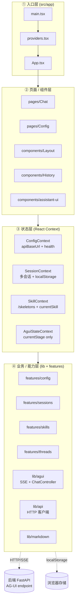
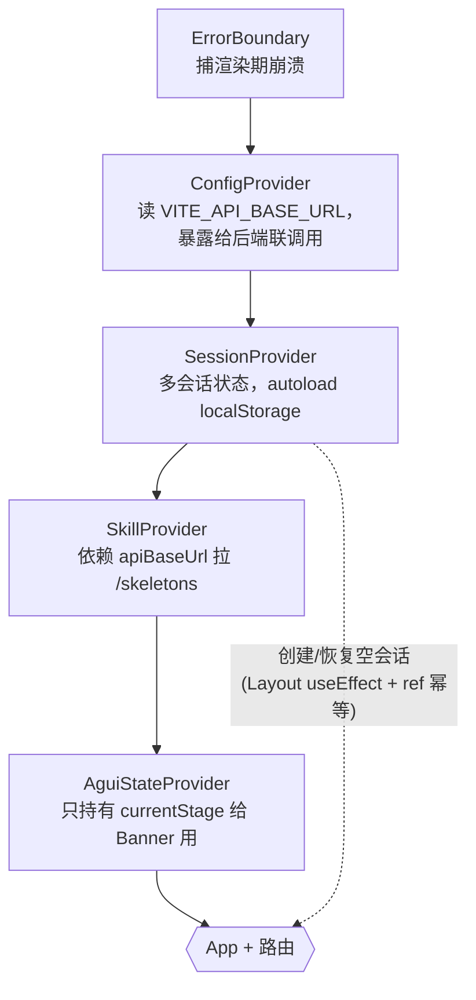
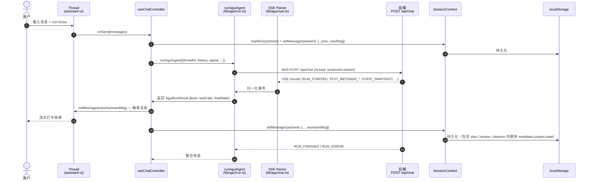
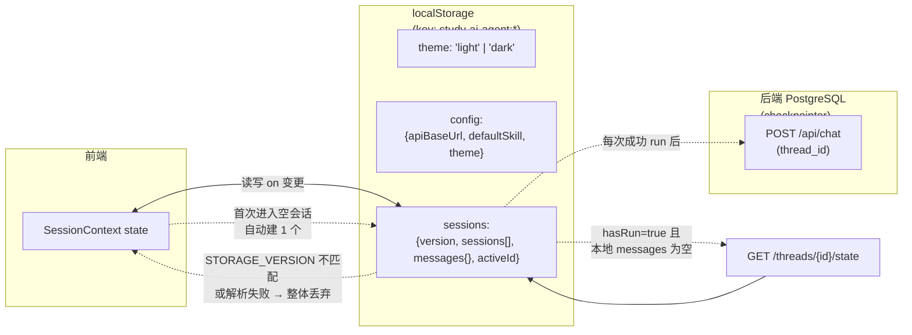
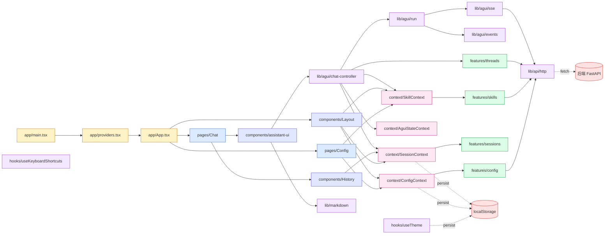

# study_ai_agent_ui — React 前端

Vite + React 18 + TypeScript + Tailwind CSS + [assistant-ui](https://www.assistant-ui.com/) 的聊天工作台，
通过 [AG-UI](https://docs.ag-ui.com/) SSE 协议与后端通信。

## 目录

- [特性](#特性)
- [快速开始](#快速开始)
- [npm 脚本](#npm-脚本)
- [环境变量](#环境变量)
- [架构](#架构)
  - [分层模型](#分层模型)
  - [Provider 装配](#provider-装配)
  - [聊天一次 run 的数据流](#聊天一次-run-的数据流)
  - [持久化模型](#持久化模型)
  - [模块依赖](#模块依赖)
- [目录结构](#目录结构)
- [关键模块](#关键模块)
- [截图占位](#截图占位)
- [常见问题](#常见问题)

## 特性

- 多会话支持（侧边栏历史 / 新建 / 切换 / 重命名 / 删除）
- 多智能体（skill）选择器，技能元数据来自后端 `/skeletons`
- 实时 SSE 流式渲染，assistant-ui 驱动
- 思考过程内联到对应消息气泡（plan / review / citations / code_changes）
- Markdown / 代码高亮（highlight.js）
- 暗色 / 亮色主题（`useTheme`）
- 快捷键：`⌘/Ctrl + K` 新建会话，`Esc` 取消运行（`useKeyboardShortcuts`）
- 多层 Layout：左导航 → 中历史 → 主聊天
- 配置页：`/config` 可临时改 API Base URL（落地到 localStorage）
- 全局 `ErrorBoundary` 捕获渲染期错误
- 切换路由（`/chat ↔ /config`）**不会**重置 Provider 状态（自动建空 session 有 ref 守护，对 React StrictMode 双调幂等）

## 快速开始

要求 **Node.js ≥ 18**。

```bash
cd study_ai_agent_ui
npm install
cp .env.example .env.local   # 可选，下面是默认值
npm run dev                 # http://localhost:3000
```

> 默认 `VITE_API_BASE_URL=http://localhost:8000`，对应后端默认监听地址。
> 后端没起来时左下角会显示 "加载失败"。

### 生产构建

```bash
npm run build       # tsc -b && vite build，输出到 dist/
npm run preview     # 本地预览构建产物
```

## Docker 启动

Docker 部署文件集中在仓库根的 `docker/` 目录，进入后用 `docker compose` 一键起后端 + 前端：

```bash
cd docker
cp .env.example .env             # 编辑后填入至少 1 个 LLM API Key
docker compose build
docker compose up -d

# 浏览器打开 http://localhost:3000
```

构建期通过 `VITE_API_BASE_URL` 注入浏览器看到的后端地址，默认 `http://localhost:8000`（同主机访问）。
镜像细节、生产化建议见 [`../docs/DOCKER.md`](../docs/DOCKER.md)。**仅构建前端镜像：**

```bash
cd docker
docker build \
  --build-arg VITE_API_BASE_URL=http://localhost:8000 \
  -t study-ai-agent-frontend -f Dockerfile.frontend ..

docker run --rm -p 3000:80 \
  -e BACKEND_UPSTREAM=http://host.docker.internal:8000 \
  study-ai-agent-frontend
```

## npm 脚本

| 命令 | 说明 |
| --- | --- |
| `npm run dev` | 启动 Vite 开发服务器（端口 3000） |
| `npm run build` | TypeScript 类型检查 + 生产构建 |
| `npm run preview` | 本地预览构建产物 |
| `npm run lint` | ESLint 检查（`eslint .`） |

## 环境变量

通过 Vite 注入，运行时 `import.meta.env.*` 读取，统一封装在 [`src/config/env.ts`](src/config/env.ts)。

| 变量 | 默认值 | 说明 |
| --- | --- | --- |
| `VITE_APP_TITLE` | `Study AI Agent` | 页面标题 |
| `VITE_PORT` | `3000` | 开发服务器端口 |
| `VITE_HOST` | `localhost` | 开发服务器主机 |
| `VITE_API_BASE_URL` | `http://localhost:8000` | 后端基础地址（同时是 `/api/chat` 的 baseURL） |
| `VITE_HEALTH_CHECK_URL` | `http://localhost:8000/health` | 健康检查地址 |

> `.env.local` 已在 `.gitignore` 中。

## 架构

> 这一节面向**第一次接触这个项目的人**。看完能知道代码在哪个目录、为什么要这样分层、一次聊天请求从发到收经历了哪些步骤。

### 分层模型

整个前端遵循 **4 层单向依赖** —— 上层可以调用下层，下层绝不能反向引用上层。



**关键约束**：

- `lib/` 和 `features/` **不能** import `pages/`、`components/`、`context/`，否则循环
- `context/` 只能 import `lib/` 和 `features/`，不能 import UI 层
- `pages/` 和 `components/` 可以自由 import 下三层

### Provider 装配

装配顺序在 [`src/app/providers.tsx`](src/app/providers.tsx)，由外到内：



**为什么这个顺序**：

1. `ErrorBoundary` 在最外层 —— 任何 Provider 初始化崩了都能兜住
2. `ConfigProvider` 先于 `SessionProvider` —— 后者的 initial loadFromBackend 需要 `apiBaseUrl`
3. `SkillProvider` 依赖 `ConfigContext` 读 `default_skill`
4. `AguiStateProvider` 独立、不依赖其它 Provider，放最内层

**`App.tsx` 把 `<Layout>` 提到 `<Routes>` 外层**（[src/app/App.tsx](src/app/App.tsx)）—— 避免每次路由切换都重建 Layout / 重新跑"首次进入自动建空会话" effect（参见 commit log 中"Layout remount" 修复）。

### 聊天一次 run 的数据流



**关键设计点**：

- **threadId = sessionId**（`crypto.randomUUID()`）—— 既是前端 localStorage key，也是后端 AG-UI / checkpointer 的 `thread_id`
- **流式不重发** —— assistant-ui 的 `useExternalStoreRuntime` 直接接 ref，避免 render 抖动
- **plan / review 内联到消息**（不在右侧面板）—— 每条 AI 消息拥有自己的 state，切换 session 不串扰
- **markRun 前置** —— 发起 run 之前 `markRun(activeId)`，后续切回本地为空时才知道该去后端拉历史（避免每次新会话都 404）

### 持久化模型



**两个"权威源"的边界**：

| 维度 | 本地 (localStorage) | 服务端 (PostgreSQL checkpointer) |
|------|---------------------|-----------------------------------|
| **写时机** | 每次消息变更 | 每次成功 run 后 |
| **读时机** | 切会话时优先读 | 本地空 + `hasRun=true` 时回填 |
| **用途** | 即时恢复、离线可用 | 跨设备、跨会话来源追溯 |
| **失败容忍** | `try/catch` 静默 + version mismatch 整体丢弃 | `fetchThreadState` 404 → null，不抛错 |

**数据版本控制**：`STORAGE_VERSION = 1` 写在 [`features/sessions/types.ts`](src/features/sessions/types.ts)，不匹配就整体清空避免脏数据 crash。

### 模块依赖

> 箭头方向 = 依赖方向。所有路径相对 `src/`。



**依赖规则**（lint 不会强制，但 PR review 会查）：

- 任何 `lib/` 文件不能 import `pages/`、`components/`、`context/`
- 任何 `features/` 文件不能 import UI 层
- `context/` 之间**不互相 import**（避免 Context 循环依赖）
- 跨 `lib/` 互引只能向下：`lib/agui → lib/api`、`lib/markdown` 不引用任何

## 目录结构

```
study_ai_agent_ui/
├── public/                          # 静态资源
├── src/
│   ├── app/                         # 入口
│   │   ├── App.tsx                  # 路由（/chat / /config），Layout 在 Routes 之外
│   │   ├── main.tsx                 # createRoot + StrictMode + BrowserRouter
│   │   └── providers.tsx            # Provider 装配（见架构图）
│   ├── pages/                       # 路由页
│   │   ├── Chat/                    # 聊天页
│   │   └── Config/                  # 系统配置页
│   ├── components/
│   │   ├── Layout/                  # 整体布局（左导航 + 中历史 + 主区 + Topbar）
│   │   ├── History/                 # 历史会话侧边栏（按日期分组 + 搜索）
│   │   ├── ErrorBoundary/           # 全局渲染期错误兜底
│   │   └── assistant-ui/            # assistant-ui 自定义组件
│   │       ├── thread.tsx           # 消息列表 + 欢迎区 + 快捷提示卡
│   │       ├── message-execution-state.tsx  # plan / review / citations 内联到消息气泡
│   │       ├── markdown-text.tsx    # Markdown + 代码高亮
│   │       ├── tool-fallback.tsx    # 工具调用渲染兜底
│   │       ├── error-toast.tsx      # 顶部错误提示
│   │       └── ui/button.tsx        # shadcn 风格 Button 基础组件
│   ├── lib/
│   │   ├── agui/                    # AG-UI SSE 客户端（核心）
│   │   │   ├── sse.ts               # fetch + ReadableStream SSE 解析
│   │   │   ├── events.ts            # AG-UI 事件归一化
│   │   │   ├── run.ts               # 一次 run 发起 + 事件聚合（纯函数）
│   │   │   ├── chat-controller.tsx  # 多会话 controller（基于 useExternalStoreRuntime）
│   │   │   ├── types.ts             # 对外类型
│   │   │   └── index.ts             # 桶导出
│   │   ├── api/                     # 通用 HTTP 封装（ApiError + createHttpClient）
│   │   ├── markdown.ts              # marked + highlight.js
│   │   └── utils.ts                 # cn() 等
│   ├── context/                     # React Context
│   │   ├── ConfigContext.tsx        # apiBaseUrl / health
│   │   ├── SessionContext.tsx       # 多会话 + 自动建空会话
│   │   ├── SkillContext.tsx         # /skeletons + currentSkill
│   │   ├── AguiStateContext.tsx     # currentStage（Banner 用）
│   │   ├── sessionContextObject.ts  # Context 实例拆分（满足 fast-refresh）
│   │   └── useSession.ts            # useSession hook 拆分（同上）
│   ├── features/                    # 业务子模块
│   │   ├── config/                  # 配置读写
│   │   ├── sessions/                # 会话类型 + localStorage 持久化
│   │   ├── skills/                  # skill API + 类型
│   │   └── threads/                 # 服务端 thread 端点（checkpointer 拉取/删除）
│   ├── hooks/                       # useTheme / useKeyboardShortcuts
│   ├── config/                      # 构建期 env 封装
│   ├── types/                       # 全局类型
│   ├── index.css                    # Tailwind 入口
│   └── vite-env.d.ts
├── index.html
├── package.json
├── tsconfig.json
├── vite.config.ts
├── tailwind.config.js
├── postcss.config.js
└── eslint.config.js
```

## 关键模块

### `lib/agui/` — AG-UI 客户端

| 文件 | 角色 |
| --- | --- |
| `sse.ts` | 基于 `fetch` + `ReadableStream` 的 SSE 解析（含自动重连、AbortSignal） |
| `events.ts` | AG-UI 事件类型到 UI 消息的归一化 |
| `run.ts` | 一次 run 的发起 + 事件聚合（**纯函数**，不依赖 React） |
| `chat-controller.tsx` | 多会话实现（基于 `useExternalStoreRuntime`），整合 SSE + 会话切换 + localStorage |
| `types.ts` | 对外类型（仅 `AguiStateSnapshot`） |
| `index.ts` | 桶导出 |

> 早期版本还有个 `adapter.ts`（兼容 assistant-ui `useLocalRuntime` / `ChatModelAdapter` 旧 API），
> 已删除 —— 整个项目统一走 `useChatController`（基于 `useExternalStoreRuntime`）。
> 如果你从老分支迁过来，请改用 `useChatController` 入口，详见 `types.ts` 头注释。

### `context/` — 全局状态

- `ConfigContext` — 后端 `apiBaseUrl`、健康检查结果，可热更新。
- `SessionContext` — 会话列表、当前活跃会话、消息计数、`hasRun` 标记（dogfood ISSUE-003 优化）。
- `SkillContext` — 后端 `/skeletons` 拉取的智能体列表 + 当前 skill。
- `AguiStateContext` — **仅**持有 `currentStage`（被 `ComposerRunningBanner` 消费），完整 plan/review/citations 已**迁出到每条 AI 消息的 `metadata.custom.state`**（见 [message-execution-state.tsx](src/components/assistant-ui/message-execution-state.tsx)）。

### `components/assistant-ui/`

- `thread.tsx` — assistant-ui `Thread` 定制（消息列表 / 欢迎区 / 快捷提示卡 / ⏹ 停止按钮 / Stage Banner）。
- `message-execution-state.tsx` — 每条 AI 消息内联的思考过程（plan / review / code_changes / citations），**替代了早期右侧 StatePanel**。
- `markdown-text.tsx` — Markdown + 代码高亮渲染（marked + highlight.js）。
- `tool-fallback.tsx` — 工具调用渲染兜底。
- `error-toast.tsx` — 顶部错误提示条。
- `ui/button.tsx` — shadcn 风格 Button 基础组件（class-variance-authority + Radix Slot）。

## 截图占位

> 正式截图请替换为实际效果。建议存到 `docs/assets/screenshots/` 下。

| 场景 | 占位 |
| --- | --- |
| 聊天主界面 |  |
| 切换智能体（coding） |  |
| 思考过程内联到消息 |  |
| 系统配置页 |  |
| 暗色主题 |  |

## 常见问题

**Q: 前端起来了但 skill 列表是空的？**
A: 看左下角"后端"地址。浏览器打开 `http://localhost:8000/skeletons` 应能看到 JSON。
若 CORS 报错，确认后端 `CORSMiddleware` 的 `allow_origins` 包含前端域名。

**Q: 改了 `VITE_API_BASE_URL` 不生效？**
A: Vite 启动时注入，运行中改需要重启 dev server；或者用 `/config` 页临时切换（走 localStorage）。

**Q: assistant-ui 报 `useExternalStoreRuntime` 找不到？**
A: 确认 `@assistant-ui/react` 版本 ≥ 0.10.50（见 `package.json`）。

**Q: 流式渲染一半就停？**
A: 后端 SSE 异常未 `RunErrorEvent` 兜底会被浏览器当作 `ERR_INCOMPLETE_CHUNKED_ENCODING` 截断。
请保留后端 [`src/core/server.py`](../study_ai_agent/src/core/server.py) 中 `event_generator` 的 try/except。

**Q: 切到 /config 再回来发现 Topbar 变成默认 skill？**
A: 历史上存在一个 Layout 重复 mount 的 bug，已修复 —— 现在 `<Layout>` 在 `<Routes>` 之外，Provider 状态不会因路由切换重置。如果还遇到，请清掉 `localStorage` 里残留的旧 session。

**Q: 找不到 `createAguiAdapter` / `AguiAdapterOptions`？**
A: 已删除，请改用 `useChatController`（基于 `useExternalStoreRuntime`），见 [`lib/agui/chat-controller.tsx`](src/lib/agui/chat-controller.tsx)。

## 许可证

[MIT](../LICENSE) © 2026 boby
